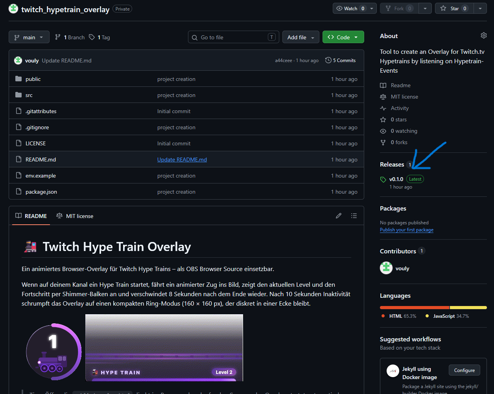
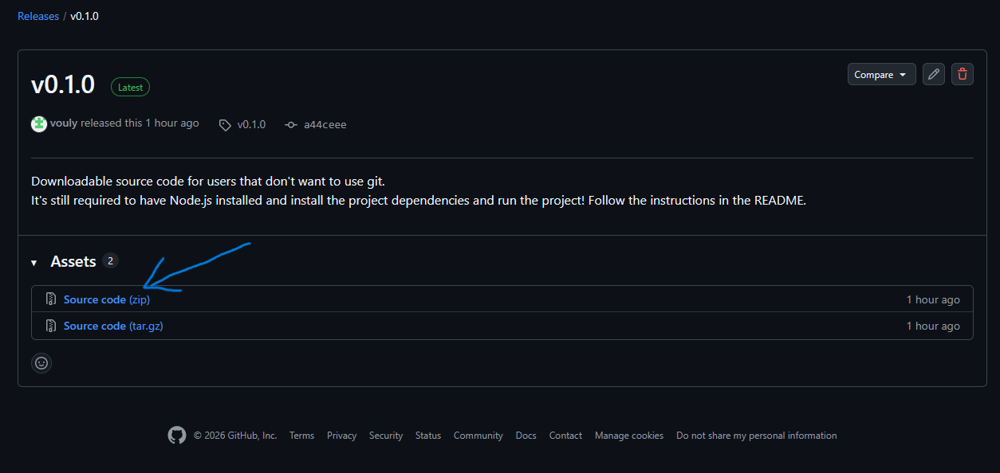
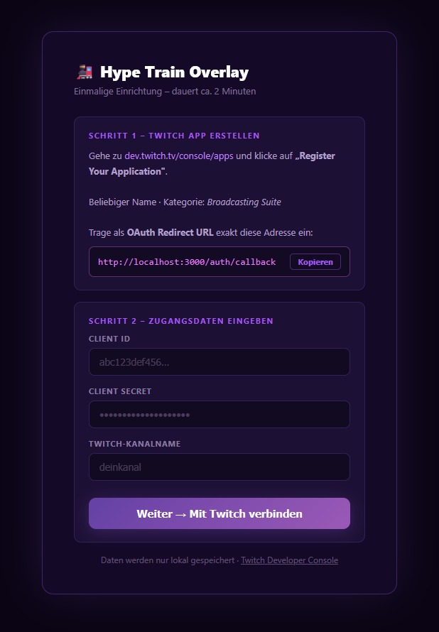
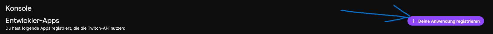
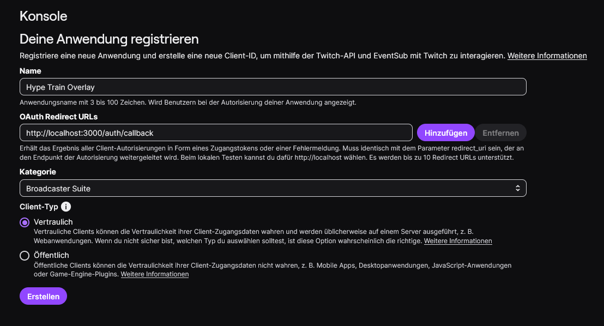
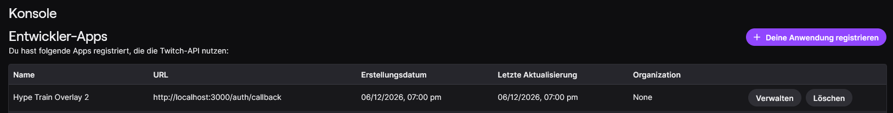
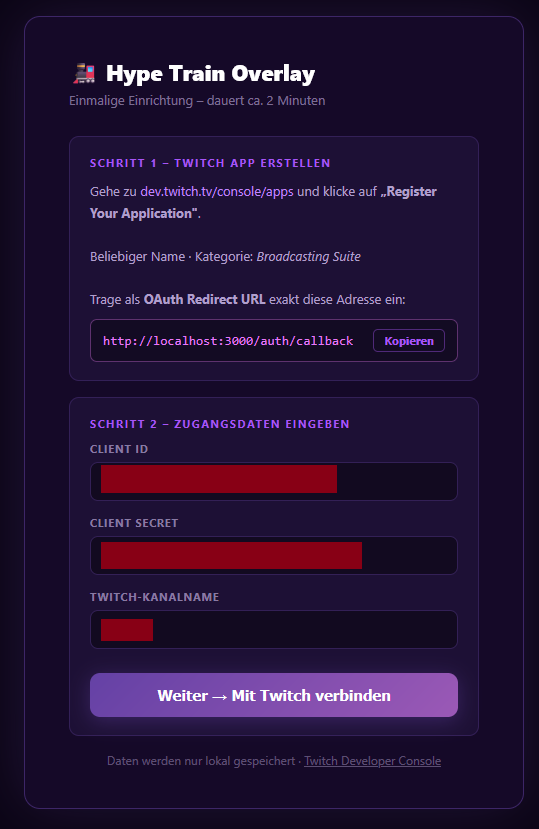
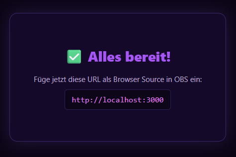
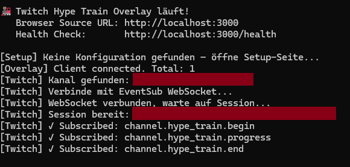

# 🚂 Twitch Hype Train Overlay Startup & Installationshilfe

Step-by-Step Anleitung dieses Tool zu nutzen

## 1. Lade den Quellcode der Applikation herunter

Klicke rechts auf die letzte veröffentlichte Version oder folge diesem Link: [Releases](https://github.com/vouly/twitch_hypetrain_overlay/releases)

Lade die Zip Datei herunter:

Entpacke den Code an einer beliebigen Stelle auf deinem Computer.

## 2. Das Programm starten

> Info: Es wird eine aktuelle Node.js Version benötigt damit alles funktioniert. Wenn du sicher bist, dass es nicht installiert ist kannst du direkt unter [https://nodejs.org](https://nodejs.org) eine aktuelle Version herunterladen (LTS-Version empfohlen).

Die Start.bat starten

Sollte Node.js nicht installiert sein, öffnet sich automatisch die Webseite von Node.js damit man es herunterladen und installieren kann. Wenn es installiert ist das Konsolenfenster schließen und die `start.bat` neu ausführen.

Beim ersten Start werden nun die Abhängigkeiten installiert. Gegebenenfalls muss anschließend die `start.bat` noch einmal ausgeführt werden.

Wenn alles funktioniert hat sollte sich nun das Konfigurationsfenster im Browser öffnen.

## Twitch App erstellen

Da die Applikation selbst gehostet wird muss eine eigene Twitch-Applikation erstellt werden. Dafür ruft man [https://dev.twitch.tv/console/apps](https://dev.twitch.tv/console/apps) auf und klickt dort auf **Deine Anwendung registrieren**

Anschließend füllt man das Formular aus
1. Name: beliebig (z. B. `Hype Train Overlay`)
2. OAuth Redirect URL: `http://localhost:3000/auth/callback`
3. Category: `Broadcasting Suite`
4. Erstellen klicken

Jetzt erscheint die neue App in der Übersicht und wir klicken auf `verwalten`

Auf dieser Seite erscheint nun unten ein weiteres Feld `Client-ID` welche wir für unsere App benötigen. Außerdem klicken wir auf den Button `Neues Geheimnis` wodurch das Secret über dem Button erscheint. Wir kopieren uns diese beiden Werte und fügen sie in unsere Konfiguration ein.

Neben der `Client-ID` und dem `Secret` geben wir unseren `Twitchnamen` (nur Kleinbuchstaben) ein und klicken auf `Weiter -> Mit Twitch verbinden`.

Wenn alles funktioniert hat, sollte nun eine Erfolgsmeldung im Browser erscheinen mit einem Link der in OBS als Browserquelle eingetragen werden kann.

In der Konsole sollte der Input inzwischen in etwa so aussehen:

Damit ist die Verknüpfung abgeschlossen und das Overlay sollte funktionieren! 🎉 

Um es zu beenden muss einfach die Konsole geschlossen werden. Bei zukünftigen Starts, muss nur die `start.bat` aufgerufen werden. Die gesamte Konfiguration ist einmalig.

## Testen

Mit laufendem Server können Events manuell ausgelöst werden – kein echter Hype Train auf dem Kanal nötig. Einfach folgende Urls aufrufen:

| URL | Beschreibung |
|---|---|
| [http://localhost:3000/test/begin?level=1&goal=1800](http://localhost:3000/test/begin?level=1&goal=1800) | Hype Train starten |
| [http://localhost:3000/test/progress?level=1&progress=900&goal=1800](http://localhost:3000/test/progress?level=1&progress=900&goal=1800) | Fortschritt setzen |
| [http://localhost:3000/test/end?level=1](http://localhost:3000/test/end?level=1) | Hype Train beenden |
| [http://localhost:3000/test/sequence](http://localhost:3000/test/sequence) | Komplette Sequenz automatisch (~12 s) |
| [http://localhost:3000/health](http://localhost:3000/health) | Serverstatus und Anzahl verbundener Clients |

Alle Query-Parameter bei `begin` und `progress` sind optional; ohne Angabe werden Standardwerte verwendet.